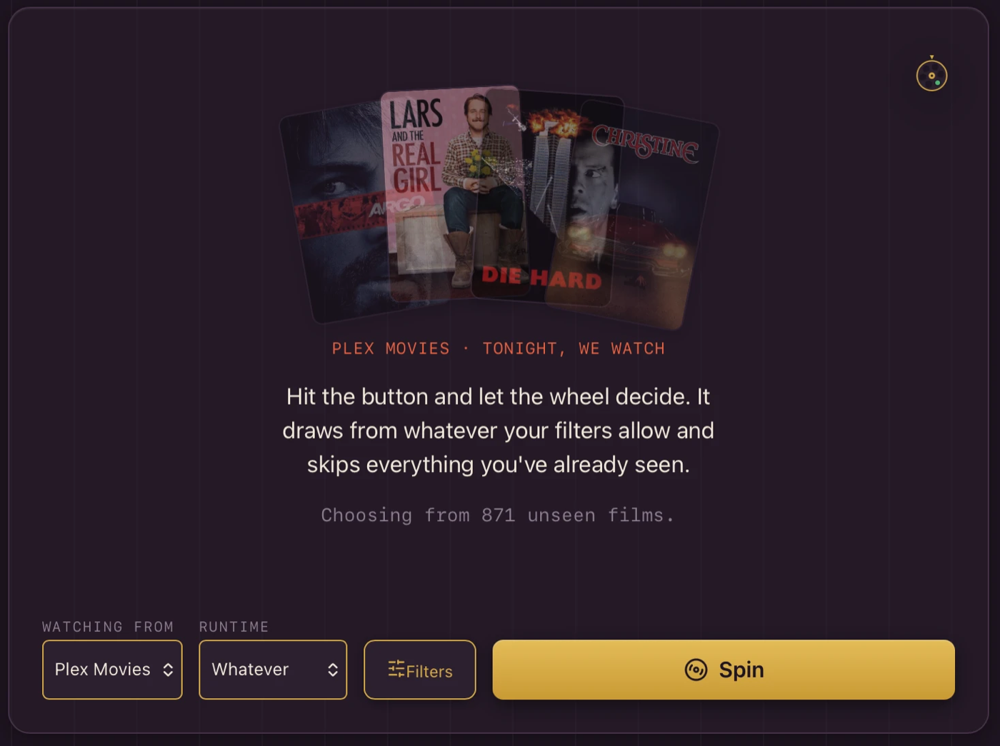
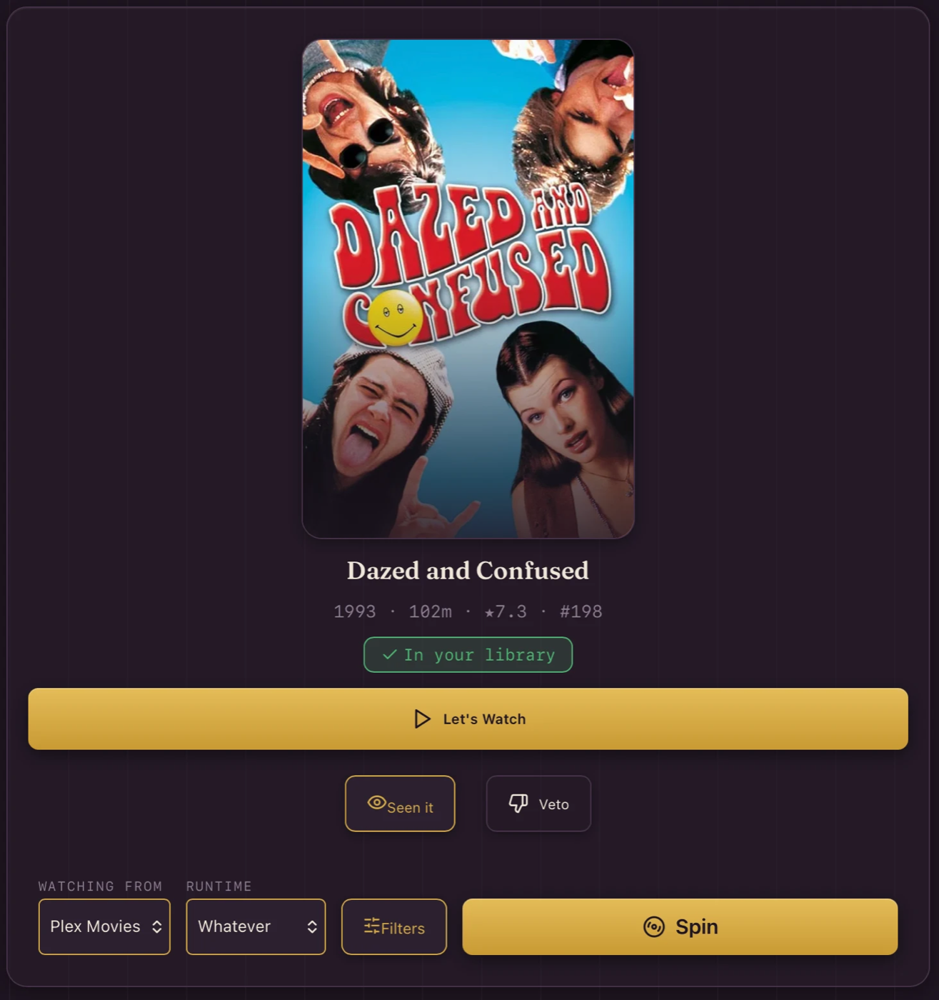
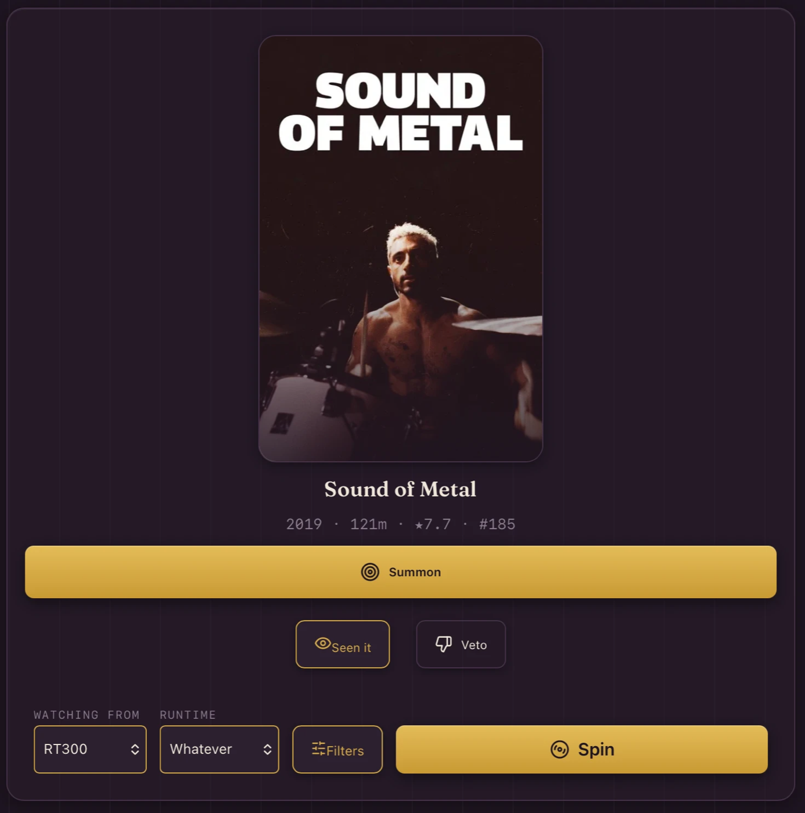
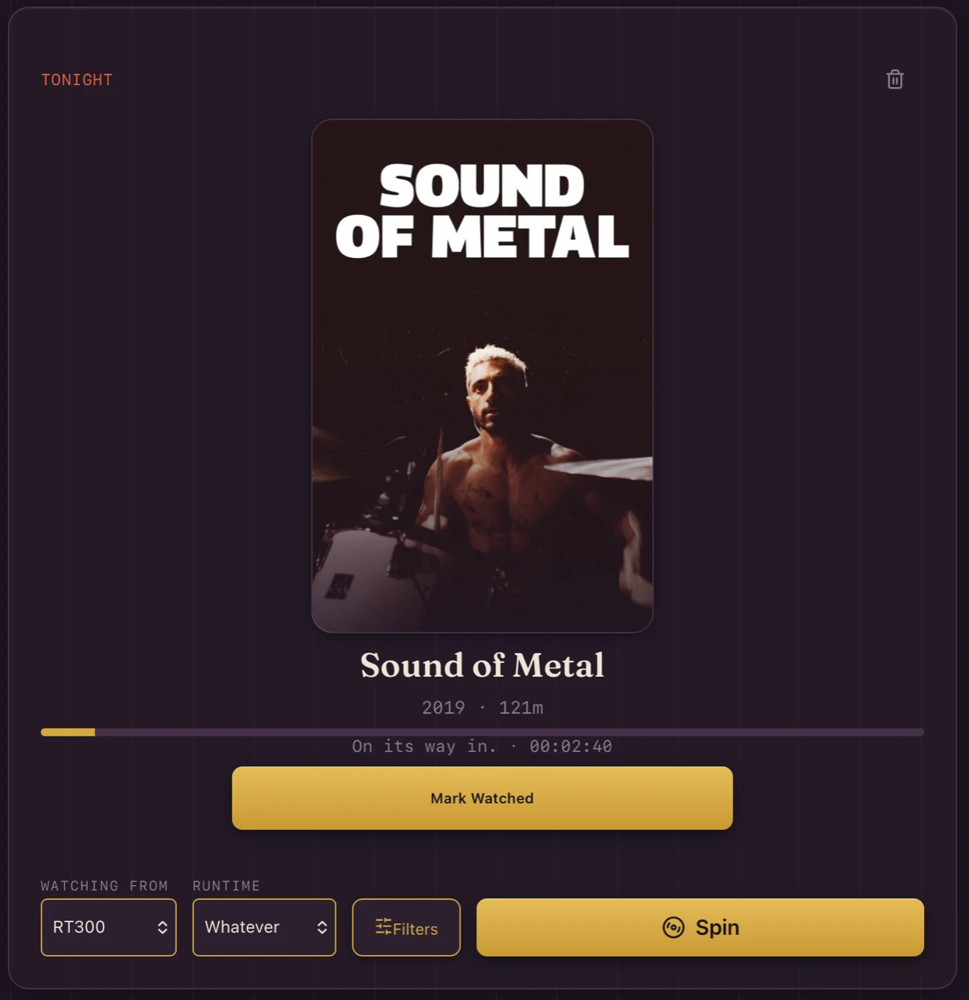
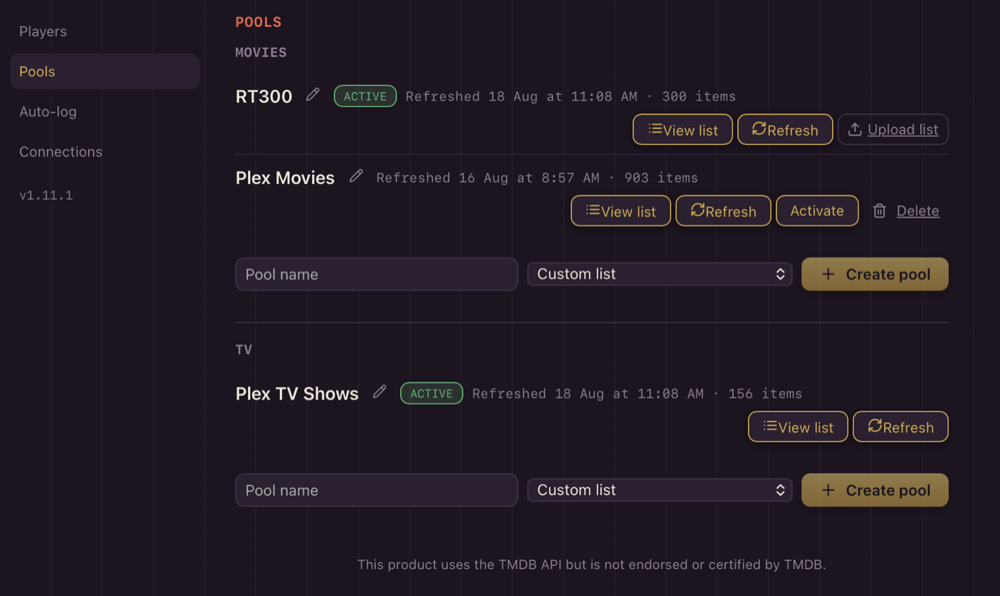

<p align="center"></p>

**The watch-night decision engine for the \*arr stack.**

You have Radarr, a Plex library, and a watchlist a mile long — and you still
spend twenty minutes arguing about what to watch. Decidarr turns the decision
into a game: spin a wheel over a curated pool, and if tonight's pick isn't in
your library yet, one tap summons it through Overseerr/Jellyseerr and
Radarr/Sonarr, with a live download progress bar until it lands.

Decidarr runs two independent streams — **Movies** and **TV** — each with its
own curated pool and its own wheel. Veto tokens, blind picks, a grudge list,
and a scoreboard turn choosing into a game instead of an argument.
Self-hosted, single Docker container, mobile-first PWA (installable to your
phone's home screen).

Decidarr is the public evolution of Swamp Roulette, a private two-player picker
already running happily in production.

<p align="center"></p>

<table>
  <tr>
    <td width="50%"></td>
    <td width="50%"></td>
  </tr>
  <tr>
    <td align="center"><em>Landed on something you own → watch it.</em></td>
    <td align="center"><em>Landed on something you don't → summon it.</em></td>
  </tr>
  <tr>
    <td width="50%"></td>
    <td width="50%"></td>
  </tr>
  <tr>
    <td align="center"><em>…and watch it arrive, live from Radarr/Sonarr.</em></td>
    <td align="center"><em>Pools come from Plex libraries, TMDB/Trakt lists, or your own CSV.</em></td>
  </tr>
</table>

## What makes it different

Existing pickers choose from what your media server already has. Decidarr
treats the whole \*arr stack as its backend: it can land on a title you don't
own yet and fetch it on the spot.

## Quick start

```bash
curl -O https://raw.githubusercontent.com/decidarr/decidarr/main/compose.yaml
docker compose up -d
```

1. Open `http://<host>:5454`.
2. Go to Settings → Players and add everyone playing.
3. Go to Settings → Connections and set up at least Overseerr/Jellyseerr
   and TMDB (see the [environment variables](#environment-variables) table
   below — everything is also configurable from the UI, no restart
   required).
4. Go to Settings → Pool and pick a pool source (Custom list, TMDB list,
   or Trakt list) for Movies and/or TV.
5. Spin.

Nothing above is mandatory to get *something* on screen — Decidarr starts
up and serves its UI even with zero integrations configured; features
degrade individually rather than blocking the app. See the
[degradation matrix](#degradation-matrix).

## Environment variables

Setup is designed to feel *arr-native: every integration below can be
configured live from Settings → Connections (URL + API key + a **Test**
button), and those values persist in the database — connecting a service
never requires a container restart. The environment variables below are an
alternative for compose-first users: they **seed** the corresponding
setting at first startup and **override** it whenever set, so you can
define everything in `compose.yaml` and never open the UI.

| Variable | Required | Description |
|---|---|---|
| `TZ` | recommended | Timezone (e.g. `Pacific/Auckland`). Governs the veto-token day boundary. |
| `DB_PATH` | no | SQLite database file path. Default `/data/decidarr.db`. |
| `URL_BASE` | no | Serve Decidarr under a subpath behind a reverse proxy, e.g. `/decidarr`. |
| `SEERR_URL` / `SEERR_API_KEY` | for summon | Overseerr or Jellyseerr — required for the "summon" (request) action. |
| `RADARR_URL` / `RADARR_API_KEY` | no | Powers the live movie download progress bar. |
| `SONARR_URL` / `SONARR_API_KEY` | no | Powers the live TV download progress bar. |
| `TV_REQUEST_SEASONS` | no | `first` (default) or `all` — what a TV summon requests. |
| `MEDIA_SERVER` | no | `plex` or `jellyfin` — enables live availability checks and deep links. |
| `PLEX_URL` / `PLEX_TOKEN` | when `MEDIA_SERVER=plex` | Plex connection. |
| `JELLYFIN_URL` / `JELLYFIN_API_KEY` | when `MEDIA_SERVER=jellyfin` | Jellyfin connection. |
| `TMDB_API_KEY` | **yes** | Pool enrichment (posters, genres, runtime, year) for every pool source. Free key at [themoviedb.org](https://www.themoviedb.org/settings/api). |
| `TRAKT_CLIENT_ID` | no | Enables the Trakt list pool source. |
| `AUTOLOG_ENABLED` | no | Auto-log watches from media-server playback (default on when `MEDIA_SERVER` is set; works with Plex and Jellyfin). `false` disables. |
| `AUTOLOG_INTERVAL` | no | Auto-log poll cadence in seconds. Default `300`. |
| `UPDATE_CHECK` | no | Once a day, ask Docker Hub whether a newer image exists and show a quiet notice in Settings. `false` disables the check entirely. |

One current asymmetry: the one-tap **"Import watched from Plex"** history
backfill is Plex-only today. Jellyfin users get everything else, including
auto-log.

See `compose.yaml` in this repo for a fully commented example with every
variable present.

## Degradation matrix

Decidarr never fails to start or 5xxs because an optional integration is
missing or unreachable — each row below degrades independently:

| Missing | Effect |
|---|---|
| `SEERR_*` | Summon button shows a "configure Overseerr" hint; spin/veto/duel unaffected. |
| `RADARR_*` | No movie progress bar; static "on its way" text instead. |
| `SONARR_*` | No TV progress bar; static "on its way" text instead. |
| `MEDIA_SERVER` credentials | Verdicts fall back to Overseerr's availability signal; no deep links. |
| `TRAKT_CLIENT_ID` | Trakt source hidden in the pool picker. |
| `TMDB_API_KEY` | Pool features are blocked at startup; `/api/health` flags it. |

## Exposure, security & backups

Decidarr is designed for a **trusted home network**. Game actions (spin,
veto, marking things seen) are deliberately open — nobody wants to log in
on movie night — while every settings write can be gated behind an
**admin PIN** (set one in Settings). There is no user authentication
beyond that, so if you expose Decidarr to the internet, put real auth in
front of it (a reverse proxy with basic auth, Authelia, Tailscale, etc.)
— the same guidance as the rest of the \*arr stack.

The container currently runs as root, the common default for simple
single-container apps; file access is limited to the `/data` mount.

**Backups:** everything Decidarr knows — players, pools, picks, and the
entire watch history — is one SQLite file at `/data/decidarr.db`. Back up
the `/data` volume and you have backed up Decidarr.

## Architecture

- `backend/` — FastAPI + SQLite (WAL), single uvicorn worker.
- `frontend/` — React 18 + Vite + TypeScript PWA, built and served by the
  backend from `static/`.
- One container, one process, port 5454.

Single-process by design: uvicorn runs exactly one worker, and there's no
`--workers` knob. The daily pool-refresh task and SQLite both assume a
single process — a multi-worker deploy would double-run the refresher and
fight over the database.

See `docs/specs/2026-07-11-decidarr-v1-design.md` for the full design
spec.

## Development

```bash
# backend
cd backend && python -m pytest tests -q       # run tests
cd backend && uvicorn app:app --port 5454 --reload

# frontend
cd frontend && npm run dev     # proxies /api to :5454
cd frontend && npx vitest run  # logic tests
cd frontend && npm run build   # tsc + vite

# full image
docker build -t decidarr .
```

## Building from source

```bash
git clone https://github.com/decidarr/decidarr.git
cd decidarr
docker build -t decidarr .
docker run -d --name decidarr -p 5454:5454 -v ./data:/data decidarr
```

## License

Decidarr is licensed under the [GNU General Public License v3.0](https://www.gnu.org/licenses/gpl-3.0.html) (GPL-3.0).

This product uses the TMDB API but is not endorsed or certified by TMDB.
